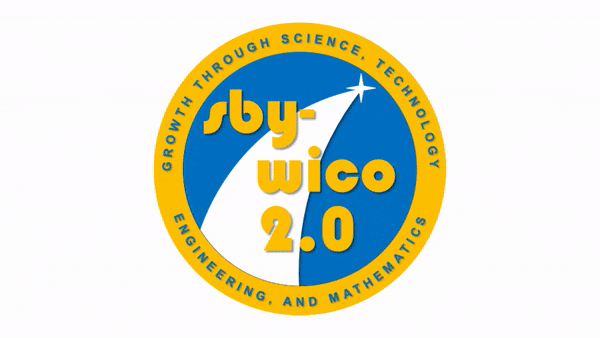

# Salisbury Wicomico 2.0

Salisbury-Wicomico 2.0 is about ***jobs***.

Well-paying local jobs. Specifically, well-paying local jobs related to science, technology, engineering, and mathematics (STEM). STEM jobs are among the best paid jobs in America, and the demand for people is high.  That’s because STEM jobs aren't just for geeks and gamers. STEM jobs include designing Beat headphones, creating movie special effects, and making everything from refrigerators to race cars better and faster.

Our schools are hard at work teaching our children STEM, but what happens after graduation? Some of the best STEM jobs are here in Maryland, but not on the Eastern Shore. We are doing something wrong when our best and brightest must look for their future across the bridge and not here at home.

This page is for us to talk about ways to attract and keep those jobs in Wicomico County. For example, we can:

- Recognize Local K Through 12 STEM Achievement
- Recognize Local STEM Supporters
- Maintain and Expand Our Organized STEM Leagues
- Help Expedite STEM Scholarships and Internships
- Incentivize Adult STEM Learning
- Attract and Recruit STEM Retirees to Our Area
- Attract STEM Events to Our Area
- Help Expedite Funding Requests for Local STEM Projects
- Research Local STEM Companies and Find out What They Need
- Research What Other Towns Are Doing to Attract STEM Companies
- Pick Up the Phone and Pitch!

***Jobs.***  We have the power grid, we have the fiber optic lines, we have the space, we are less expensive than the West, and we are the "Crossroads of Delmarva." We want these jobs, we NEED these jobs, and we are ready for these jobs. Let's do this!

[Read the white paper](paper/garcia-salisbury-wicomico-2-180730.pdf) about STEM development on the Eastern Shore.
